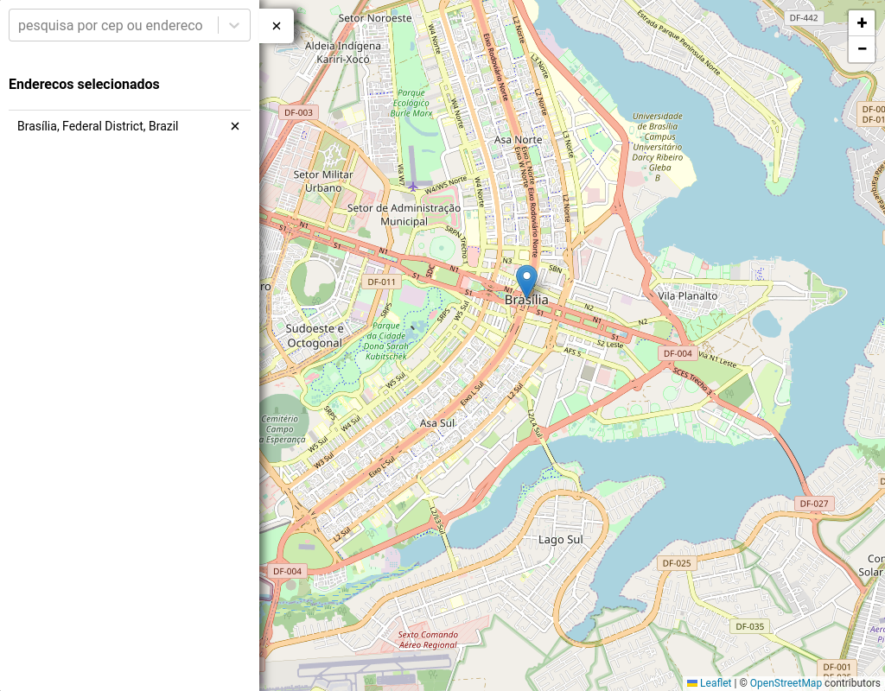
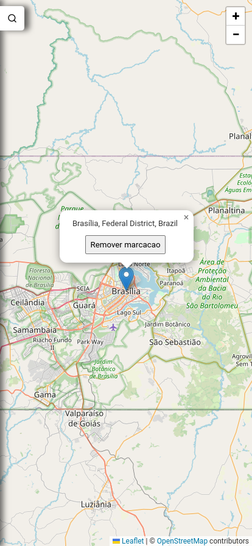

# Find my address

Projeto simples para fins de aprendizado e aperfeicoamento de habilidades para a implantacao de um map utilizando react-leaflet

## 🚀 Começando

Comece clonando o projeto para sua maquina local

### 🔧 Instalação das dependencias

Caso utilize yarn:

```
yarn
```

Caso utilize npm:

```
npm install
```

## ⚙️ Executando os testes

Testes ainda nao implementados

## 🛠️ Construído com

- [ReactJs](https://react.dev/) - O framework web usado
- [React Leafletjs](https://react-leaflet.js.org/) - Componentes React para mapas Leaflet
- [Yarn](https://yarnpkg.com/) - Gerente de Dependência
- [Styled-Components](https://styled-components.com/) - Usado para estilizar componentes
- [Axios](https://axios-http.com/ptbr/docs/intro) - Cliente HTTP usado para as requisicoes
- [React-Select](https://react-select.com/home) - Componente Assincrono para a listagem dos enderecos
- [TypeScript](https://www.typescriptlang.org/) - Linguagem de programação fortemente tipada baseada em JavaScript
- [Cypress](https://www.cypress.io/) - Ferramenta escolhida para os testes

## ✒️ Autor

- **Leonardo Lima** - _Desenvolvedor Frontend_ - [github](https://github.com/leonardobl)

## 🎁 Me ajude com esse projeto

- Conte a outras pessoas sobre este projeto 📢;
- Sugira melhorias🍺;
- Implemente voce mesmo, adoraria ter sua colaboracao 🫂;

---

## 🎁 Prints do projeto

<div align="center"> 
 
<span width="20"></span>

</div>

⌨️ com ❤️ por [Leonardo Lima](https://github.com/leonardobl) 😊
